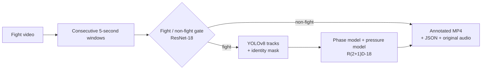
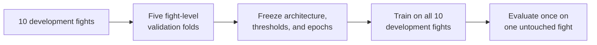

# MMA Fight Analyzer

Deep-learning pipeline for recognizing fight footage, fight phase, and pressure in UFC broadcast video.

**Technion Deep Learning final project, Spring 2026** — Maximilian Bershtman and Reut Yosefa Vitzner

The system reads a complete fight video in consecutive 5-second windows and produces an annotated video. Each window shows:

- fight or non-fight footage;
- one of five fight phases;
- which fighter is applying pressure, or whether pressure is mutual;
- tracked fighter boxes with persistent names.

> **Fighter convention:** Fighter 1 is the name shown on the **left** of the broadcast timer. Fighter 2 is the name on the right.

## Pipeline





The deployed identity tracker combines a one-time user confirmation, comparative shorts-color evidence, and temporal continuity. It deliberately stops assigning identity during merged or ambiguous grappling frames instead of risking a fighter swap.

## Results

Model selection used five fight-level development folds. One complete fight, **Paddy Pimblett vs Michael Chandler**, was kept untouched until every model and threshold choice was frozen.

| Component | Development result | Untouched fight |
|---|---:|---:|
| Fight gate | 98.0% fight retention; 77.4% non-fight rejection | 100% retention; 73.7% rejection |
| Phase | macro-F1 0.662; accuracy 0.724 | macro-F1 0.495; accuracy 0.724 |
| Pressure | macro-F1 0.436; accuracy 0.498 | macro-F1 0.327; accuracy 0.353 |

The gate and broad phase recognition are the strongest parts of the system. Directional pressure is an experimental extension and is less reliable, especially during grappling. See [the complete experiment results](docs/EXPERIMENT_RESULTS_2026-07-14.md) for per-class results, ablations, and negative results.

## Quick start: interactive demo

Python 3.10 or newer is recommended. A CUDA GPU is strongly recommended for a full fight, but the demo also runs on CPU.

```bash
git clone https://github.com/Maximilianb1/mma-fight-analyzer.git
cd mma-fight-analyzer
python -m venv .venv
```

Activate the environment:

```bash
# Windows PowerShell
.venv\Scripts\Activate.ps1

# macOS/Linux
source .venv/bin/activate
```

Install dependencies and download the three frozen checkpoints:

```bash
python -m pip install --upgrade pip
pip install -r requirements.txt
python scripts/download_models.py
```

Start the app:

```bash
streamlit run tools/demo_app.py
```

Then upload a fight video or enter a local path. The app finds a clear two-fighter frame and asks once which box is Fighter 1. After inference it displays the full annotated video, a window-by-window table, and download buttons for the video and JSON timeline.

The app also offers the held-out fight automatically when its clips are available under `data/raw/Paddy Pimblett vs Michael Chandler/`. Raw videos are not included in Git because of size and broadcast copyright.

## Command-line inference

The same complete pipeline can run without Streamlit:

```bash
python scripts/infer.py \
  --video path/to/fight.mp4 \
  --f1-name "Fighter A" \
  --f2-name "Fighter B"
```

The command opens or saves an A/B identity frame and asks which box is Fighter 1. For unattended inference, provide distinct shorts colors:

```bash
python scripts/infer.py \
  --video path/to/fight.mp4 \
  --f1-name "Fighter A" --f1-color black \
  --f2-name "Fighter B" --f2-color red
```

The annotated MP4 and per-window JSON file are written beside the input unless `--out` is supplied. Audio is preserved when FFmpeg is available; `imageio-ffmpeg` supplies a compatible binary through the project dependencies.

## Run the tests

The tests cover overlays, identity assignment and abstention, fighter mapping, and video progress reporting. They do not require model checkpoints or the dataset.

```bash
pytest -q
```

To check that every command-line entry point loads correctly:

```bash
python scripts/infer.py --help
python scripts/train_gate.py --help
python scripts/train_phase.py --help
```

## Reproduce training and evaluation

The labeled dataset contains 11 fights split into 1,159 live-fight clips and 156 excluded clips. Each clip is five seconds long. Labels are stored in CSV files with phase, pressure, and exclusion fields.

```bash
# Download labeled clips from the project Drive folder
python scripts/download_data.py

# Decode 16 frames per clip and build fighter-identity masks once
python scripts/preprocess.py

# Development cross-validation and frozen final gate
python scripts/train_gate.py --folds all
python scripts/train_gate.py --final

# Selected phase and pressure experiments
python scripts/train_phase.py --model r2plus1d
python scripts/train_phase.py --model r2plus1d --task pressure

# Train frozen deployment checkpoints after model selection
python scripts/train_phase.py --model r2plus1d --run-name deployment_phase --final --final-epochs 8
python scripts/train_phase.py --model r2plus1d --task pressure --run-name deployment_pressure --final --final-epochs 10

# Summaries and end-to-end held-out evaluation
python scripts/evaluate.py
python scripts/evaluate_holdout_pipeline.py \
  --phase outputs/phase/deployment_phase_holdout_preds.npz \
  --pressure outputs/phase/deployment_pressure_holdout_preds.npz
```

All data splits are made by complete fight, never by random clip. The held-out fight is excluded from architecture selection, early stopping, threshold selection, ablations, and smoothing decisions.

For the full experiment suite, use [notebooks/kaggle_full_experiments.ipynb](notebooks/kaggle_full_experiments.ipynb) with a Kaggle T4 GPU. [notebooks/colab_train.ipynb](notebooks/colab_train.ipynb) is a smaller launcher for the same scripts in Google Colab.

## Repository structure

```text
mma-fight-analyzer/
|-- README.md                    project overview and instructions
|-- requirements.txt            Python dependencies
|-- data/
|   `-- fights_meta.csv          training-time fighter color metadata
|-- docs/
|   |-- TECHNICAL.md             models, tensors, training, and inference
|   |-- DECISIONS.md             concise design rationale
|   |-- EXPERIMENT_RESULTS_...md final quantitative results
|   `-- PRESSURE_INVESTIGATION.md identity-supervision failure analysis
|-- notebooks/
|   |-- kaggle_full_experiments.ipynb
|   `-- colab_train.ipynb
|-- scripts/                     download, preprocess, train, evaluate, infer
|-- src/mma/                     reusable datasets, models, tracking, pipeline
|-- tests/                       fast automated tests
`-- tools/
    |-- demo_app.py              Streamlit inference demo
    `-- labeler.py               annotation tool used to build the dataset
```

Generated material is intentionally excluded from Git:

- `data/raw/` and `data/cache/`;
- `outputs/`, checkpoints, predictions, and annotated videos;
- uploaded videos and downloaded YOLO weights;
- experiment ZIP files and Python caches.

The three deployment checkpoints are published separately as GitHub Release assets and are placed in the expected `outputs/` paths by `scripts/download_models.py`.

## Labels

**Fight/non-fight:** “Fight” means the window contains the live bout during an active round, including quiet circling or positional control. “Non-fight” means broadcast material outside the live action, such as a replay, walkout, introduction, between-round break, crowd shot, interview, or studio segment. It does not attempt to detect violence in arbitrary videos.

**Phase** describes the main type of action:

- **Striking:** an open-distance standing exchange dominated by punches or kicks.
- **Grappling/Ground Work:** control, submissions, escapes, or strikes while fighting on the canvas.
- **Clinch:** close upright body contact, often against the cage.
- **Transition/Takedown:** a takedown attempt, throw, scramble, stand-up, or another change between positions.
- **Neutral/Measuring Distance:** separated fighters circling, feinting, or probing without a committed exchange.

**Pressure** describes who is imposing the initiative through forward movement, sustained attack, cage control, or positional control. It is not official scoring or a measure of damage. Labels are Fighter 1, Fighter 2, or Mutual when neither clearly controls the action.

## Known limitations

- Pressure direction generalizes less reliably than fight phase.
- Due to time constraints, the phase and pressure labels were assigned by one annotator. Subjective decisions—especially who is applying pressure—may therefore reflect that annotator's judgment, and inter-annotator agreement was not measured.
- YOLOv8 may merge fighters or detect a referee during close grappling.
- When identity evidence is ambiguous, the demo marks pressure as uncertain rather than showing a potentially swapped name.
- The dataset is modest and contains UFC-style broadcast footage only.
- Videos and labels are for academic research; this system is not intended for judging, officiating, betting, or safety decisions.

## Additional documentation

- [Technical documentation](docs/TECHNICAL.md)
- [Design decisions](docs/DECISIONS.md)
- [Final experiment results](docs/EXPERIMENT_RESULTS_2026-07-14.md)
- [Pressure and identity investigation](docs/PRESSURE_INVESTIGATION.md)

The final written report contains the ethics statement required by the course template.
